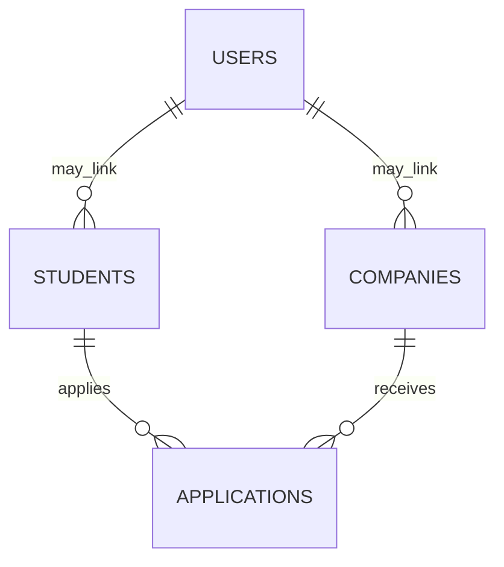

# Planning & Schema

## 1. User Personas

- Student
  - Sees: own profile, their applications and stages, company directory, apply button, personal notes.
  - Actions: edit profile, apply to company, view application status, add notes to own applications.

- Company (Partner)
  - Sees: company profile, applications submitted to their company (applicant list), ability to change stage for applicants, add interview notes.
  - Actions: update company profile, advance/reject applicants, export applicants CSV.

- Admin
  - Sees: full system (students, companies, applications, stats), can CRUD any resource, manage users.
  - Actions: create/delete students/companies, view pipeline, run exports, manage users and roles.

## 2. State Management Mapping

- Top-level app state (React):
  - `auth`: { token, user: { userId, role, studentId, companyId } }
  - `ui`: { view, activeTab, showAddModal }
  - `data`: { students[], companies[], applications[], stats }

- Flow:
  1. Unauthenticated -> Landing -> Auth view (login/register)
  2. On successful login -> fetch `students`, `companies`, `stats`, `applications` (filtered by role)
  3. Navigation via `activeTab` between `dashboard`, `students`, `companies`
  4. Actions (apply, advance, CRUD) call API -> on success refresh related resources

## 3. ERD (Entities)

- Users (id, email, password_hash, role, student_id, company_id)
- Students (id, full_name, major, gpa)
- Companies (id, name, industry, openings)
- Applications (id, student_id, company_id, position, stage, notes, created_at)

Relationships:
- Users -> Student (1:1 optional) via `student_id`
- Users -> Company (1:1 optional) via `company_id`
- Students -> Applications (1:N)
- Companies -> Applications (1:N)

## Next steps
- Add improved frontend styling (Tailwind) and component layout
- Implement Kanban pipeline and real-time updates (WebSockets)
- Add charts and export functions

